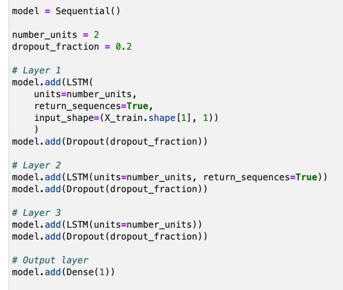
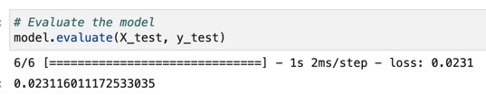
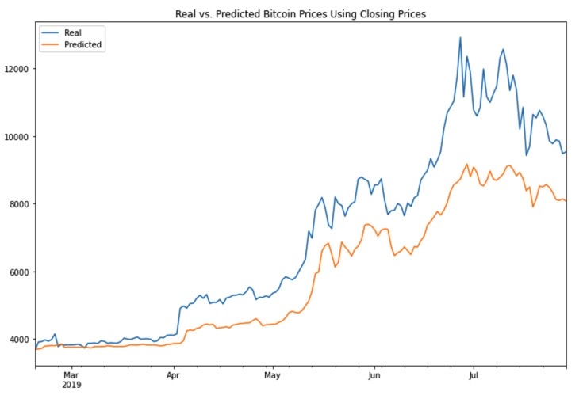
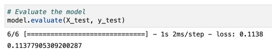
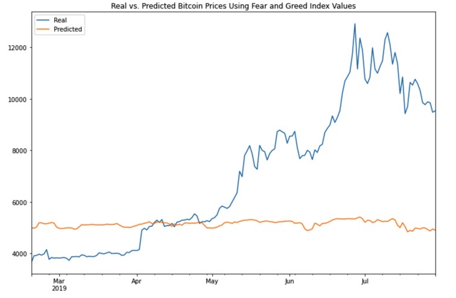

## LSTM Stock Predictor

#### Due to the volatility of cryptocurrency speculation, investors will often try to incorporate sentiment from social media and news articles to help guide their trading strategies. One such indicator is the Crypto Fear and Greed Index (FNG) which attempts to use a variety of data sources to produce a daily FNG value for cryptocurrency. The following script will build and evaluate deep learning models using both the FNG values and simple closing prices to determine if the FNG indicator provides a better signal for cryptocurrencies than the normal closing price data.

### LSTM RNN Model Using Closing Prices

We built and trained an LSTM RNN model using a 10 day window of closing prices to predict the 11th day closing price. However, after experimenting with various window sizes, I found two days yielded the lowest loss rate %.  Refer to lstm_stock_predictor_closing.ipynb file for detailed code.

The following plot illustrates the real vs. predicted values using a 2-day window of closing prices to predict the nth closing price. 

### LSTM RNN Model Using Fear and Greed Index Values

We built and trained an LSTM RNN model using the FNG indicators to predict the closing price.  Refer to lstm_stock_predictor_fng.ipynb file for detailed code. 

The following plot illustrates the real vs. predicted values using the FNG indicators to predict closing price. 

### Conclusions

##### Which model has a lower loss? 
The LSTM RNN model using simple closing prices has a lower loss of 2.3%. 

##### Which model tracks the actual values better over time? 
The LSTM RNN model using bitcoin closing prices tracks the actual values better over time in comparison to using the FNG indicators.

##### Which window size works best for the model? 
A smaller window size appears to work best for this model (i.e. window size of 2). 
